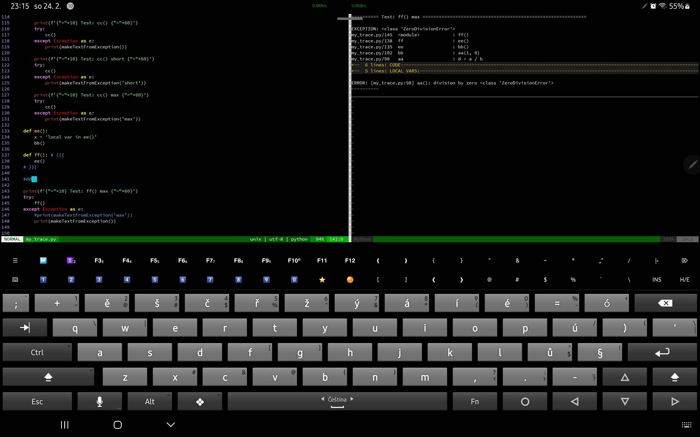

# my_trace.py

Help for quick debugging of the program.

From the captured exception, it generates detailed information that includes:
- function call flow
- the part of the code preceding the error
- listing of local variables

Example usage:
```py
from my_trace import makeTextFromException

try:
    x = 5 / 0
except Exception as e:
    print(makeTextFromException('max'))
```

Possible parameters are:
- max   - prints the code and local variables from call of each parent function
- full  - prints the code and local variables for the last function where the error occurred
- short - a shortened listing

Sample output (from self-test, setting full):
```none
========== Test: ff() max ============================================================

EXCEPTION: <class 'ZeroDivisionError'>
my_trace.py/145  <module>            : ff()
my_trace.py/138  ff                  : ee()
my_trace.py/135  ee                  : bb()
my_trace.py/102  bb                  : aa(1, 0)
my_trace.py/98   aa                  : d = a / b
{{{ CODE
   95     def aa(a, b):
   96         '''Test function where an exception occurs.'''
   97         c = ['q', 123, None]
   98         d = a / b
}}} CODE
{{{ LOCAL VARS:
a   = (<class 'int'>) 1
b   = (<class 'int'>) 0
c   = (<class 'list'>) ['q', 123, None]
}}}

ERROR: [my_trace.py:98] aa(): division by zero <class 'ZeroDivisionError'>
----------
```
The output contains {{{ and }}} tags for Vim foldering.



